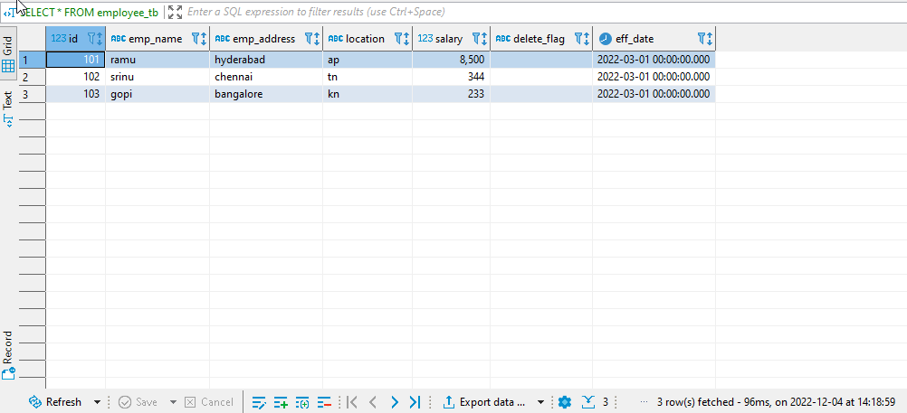
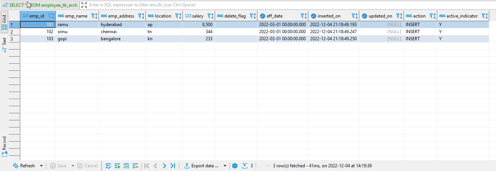
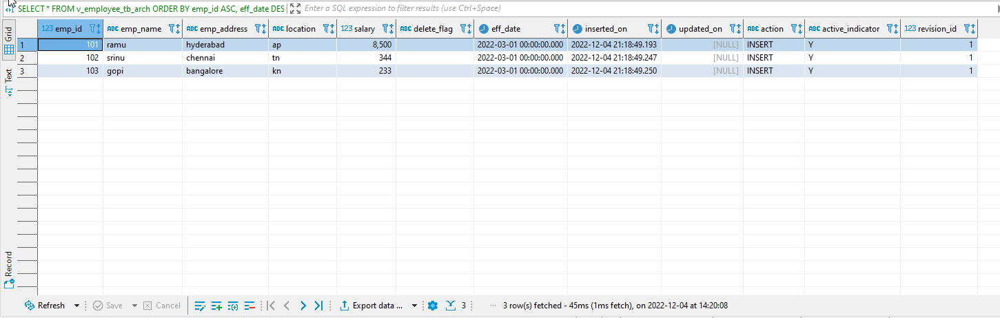
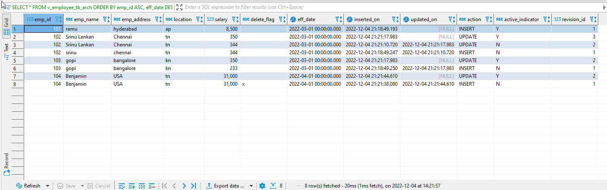

# Log a table's changes to audit table

## Overview

this project takes the example found on youtube(https://www.youtube.com/watch?v=50NBCorAXS4) and modifies the process
so a user can specify when a change happens.  The process showed in the video assumes the effective date of change is the moment the update / insert transaction is commited.  For some business use cases the user will need to back populate effective date.  The process shown below enables this kind of functionality.

## Teardown 

- stop containers and delete volume

```bash
docker compose down -v
```

## Getting Started

### View docker compose file

- `cd` to directory containing `docker-compose.yml`
- verify the password/port you want to use


### Spin up docker compose

- start the container(s)

```bash
docker compose up -d
```

- verify compose created a container on the port you expect

```bash
docker ps -a
```

### Sreate database

```sql
CREATE DATABASE SCDTEST;

--USE SCDTEST
```

## 01 create employee table

```sql
--drop TABLE employee_tb;
create table employee_tb(
      id int not null
    , emp_name varchar(100) 
    , emp_address varchar(100)
    , location varchar(100)
    , salary int
    , delete_flag varchar(1) not null constraint df_employee_delete default ''
    , eff_date datetime not null
);
```

## 02 create employee audit table

```sql
--drop table employee_tb_arch;
create table employee_tb_arch (
      emp_id int not null
    , emp_name varchar(100)
    , emp_address varchar(100)
    , location varchar(100)
    , salary int
    , delete_flag varchar(1) not null 
    , eff_date datetime not null
    , inserted_on datetime not null
    , updated_on datetime
    , action varchar(100) not null
    , active_indicator varchar(10)
);
```

## 03 create a view for employee audit table

```sql
--DROP VIEW v_employee_tb_arch;

CREATE VIEW v_employee_tb_arch AS
SELECT *,
ROW_NUMBER() OVER (PARTITION BY emp_id,eff_date ORDER BY eff_date ASC,inserted_on ASC) as revision_id
FROM employee_tb_arch;
```

## 04 create trigger on employee table

```sql
DROP TRIGGER dbo.tr_employee_tb_audit;

CREATE TRIGGER dbo.tr_employee_tb_audit 
ON dbo.employee_tb 
AFTER INSERT, UPDATE
AS
BEGIN

SET NOCOUNT ON;

INSERT INTO employee_tb_arch (
      emp_id
    , emp_name
    , emp_address
    , location
    , salary
    , delete_flag
    , eff_date
    , active_indicator
    , inserted_on
    , updated_on
    , action
)
SELECT
      emp_id
    , emp_name
    , emp_address
    , location
    , salary
    , delete_flag
    , eff_date
    , active_indicator
    , inserted_on
    , updated_on
    , action
FROM (
    MERGE INTO employee_tb_arch d
    USING employee_tb s
    ON (s.id = d.emp_id) AND (s.eff_date=d.eff_date) AND d.active_indicator = 'Y'
    WHEN MATCHED AND 
        d.emp_name <> s.emp_name OR
        d.emp_address <> s.emp_address OR
        d.location <> s.location OR
        d.salary <> s.salary OR
        d.delete_flag <> s.delete_flag AND active_indicator = 'Y'
        THEN UPDATE SET 
            d.updated_on = GETDATE()
          , d.active_indicator = 'N'
    WHEN NOT MATCHED BY TARGET THEN
        INSERT (emp_id,emp_name,emp_address,location,salary,delete_flag,eff_date,active_indicator,inserted_on,updated_on,action)
        VALUES (s.id,s.emp_name,s.emp_address,s.location,s.salary,s.delete_flag,s.eff_date,'Y',GETDATE(),NULL,'INSERT')
    OUTPUT $action,s.id,s.emp_name,s.emp_address,s.location,s.salary,s.delete_flag,s.eff_date,'Y',GETDATE(),NULL
) AS CHANGES
(action,emp_id,emp_name,emp_address,location,salary,delete_flag,eff_date,active_indicator,inserted_on,updated_on)
WHERE ACTION='UPDATE'
END;
```

## 05 insert some data into the employee table

```sql
insert into employee_tb(id,emp_name,emp_address,location,salary,eff_date) 
values(101,'ramu','hyderabad','ap',8500,'2022-03-01');

insert into employee_tb(id,emp_name,emp_address,location,salary,eff_date) 
values(102,'srinu','chennai','tn',344,'2022-03-01');

insert into employee_tb(id,emp_name,emp_address,location,salary,eff_date) 
values(103,'gopi','bangalore','kn',233,'2022-03-01');
```

## 06 view data

- current table raw

```sql
SELECT * 
FROM employee_tb;
```




- audit table raw

```sql
SELECT * 
FROM employee_tb_arch;
```



- audit table view

```sql
SELECT *
FROM v_employee_tb_arch
ORDER BY emp_id ASC, eff_date DESC,inserted_on DESC;
```



## 07 update some data on employee table

- update employee name and address

```sql
-- this data will come from a form submission
UPDATE employee_tb SET
  emp_name = 'Srinu Lankan'
, emp_address = 'Chennai'
WHERE id = 102 AND eff_date = '2022-03-01';
```
- update salary

```sql
-- this data will come from a form submission
UPDATE employee_tb SET salary = 350
WHERE id in (102,103) AND eff_date = '2022-03-01';
```
## 08 upsert data to employee table

- create new record then update it to remove the delete flag

```sql
MERGE INTO employee_tb d
USING (
-- this data will come from a form submission
SELECT 
	  104 as id
	,'Benjamin' as emp_name
	,'USA' as emp_address
	,'tn' as location
	,'31000' as salary
    , 'x' as delete_flag
	,'2022-04-01' as eff_date
) AS s
ON (s.id = d.id) AND (s.eff_date = d.eff_date)
WHEN MATCHED AND
	d.emp_name <> s.emp_name OR
	d.emp_address <> s.emp_address OR
    d.location <> s.location OR
    d.salary <> s.salary OR
    d.delete_flag <> s.delete_flag
    THEN UPDATE SET 
    	  emp_name = s.emp_name
    	, emp_address = s.emp_address 
    	, location = s.location
    	, salary = s.salary
        , delete_flag = s.delete_flag
WHEN NOT MATCHED BY TARGET THEN
	INSERT (id,emp_name,emp_address,location,salary,delete_flag,eff_date)
	VALUES (s.id,s.emp_name,s.emp_address,s.location,s.salary,s.delete_flag,s.eff_date);


-- undu the delete flag
UPDATE employee_tb
SET delete_flag = ''
WHERE id = 104;
```

## 09 view the audit table

```sql
SELECT *
FROM v_employee_tb_arch
ORDER BY emp_id ASC, eff_date DESC,inserted_on DESC;
```



## references

- [Docker - Microsoft SQL Server](https://hub.docker.com/_/microsoft-mssql-server)

- [Example Docker Compose File](https://blog.logrocket.com/docker-sql-server/)
    - the images is out of date on this example

- [SSMS Download](https://learn.microsoft.com/en-us/sql/ssms/download-sql-server-management-studio-ssms?view=sql-server-ver16)
